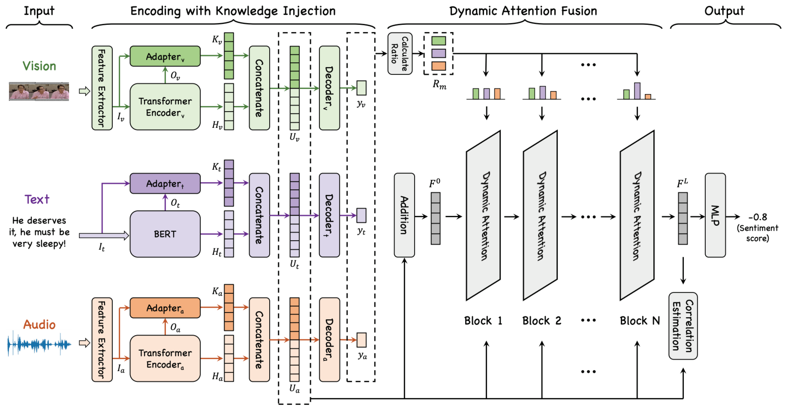

# **KuDA**

#### Codebase for EMNLP 2024 Findings Paper:

> **Knowledge-Guided Dynamic Modality Attention Fusion Framework for Multimodal Sentiment Analysis**

#### Model Architecture:



The code was refactored to integrate all datasets; please contact me if you find any bugs. Thanks.

## **Content**

- [Data Preparation](#1)
- [Environment](#2)
- [Running](#3)
- [Note](#4)
- [Citation](#5)

<h2 id="1">Data Preparation</h2>

KuDA uses four MSA datasets and BERT in the corresponding languages: Chinese (**CH-SIMS**, **CH-SIMSv2**) and English (**CMU-MOSI**, **CMU-MOSEI**).

### **Datasets**

- CH-SIMS / CMU-MOSI / CMU-MOSEI can be downloaded from [MMSA](https://github.com/thuiar/MMSA).
- CH-SIMSv2 can be downloaded from [ch-sims-v2](https://github.com/thuiar/ch-sims-v2) (Supervised).

### **Pretrained Language Modal**

- CH-SIMS / CH-SIMSv2: [bert-base-chinese](https://huggingface.co/google-bert/bert-base-chinese).
- CMU-MOSI / CMU-MOSEI: [bert-base-uncased](https://huggingface.co/google-bert/bert-base-uncased).

<h2 id="2">Environment</h2>

The paper's basic training environment for its results is Python 3.8, Pytorch 1.9.0 with a single NVIDIA RTX 3090. Notably, different hardware and software environments can cause the results to fluctuate.

<h2 id="3">Running</h2>

### **Knowledge Inject Pretraining**

There are two ways to obtain weights of knowledge injection:

1. Execute the following command to pretrain each modality:

   ```shell
   python pretrain.py
   ```

2. The weights we have previously trained can be downloaded from this [link](https://pan.baidu.com/s/1oQX_T2JX1xfPr96eehjDQg?pwd=ny4v).

### **Multimodal Sentiment Analysis**

```shell
python train.py
```

<h2 id="4">Note</h2>

1. In `Encoder_KIAdapter.py`, you need to modify the source code of `torch.nn.TransformerEncoder` to return the intermediate hidden statues. The code can be modified as follows:

   ```python
   class TransformerEncoder(Module):
    r"""TransformerEncoder is a stack of N encoder layers
    """
    __constants__ = ['norm']

    def __init__(self, encoder_layer, num_layers, norm=None):
        super(TransformerEncoder, self).__init__()
        self.layers = _get_clones(encoder_layer, num_layers)
        self.num_layers = num_layers
        self.norm = norm

    def forward(self, src: Tensor, mask: Optional[Tensor] = None, src_key_padding_mask: Optional[Tensor] = None) -> Tensor:
        r"""Pass the input through the encoder layers in turn.
        """
        output = src
        hidden_state_list = []
        hidden_state_list.append(output)

        for mod in self.layers:
            output = mod(output, src_mask=mask, src_key_padding_mask=src_key_padding_mask)
            hidden_state_list.append(output)

        if self.norm is not None:
            output = self.norm(output)

        return output, hidden_state_list
   ```

2. After completing the preparation of data and models, the file structure is as follows:

   ```txt
   ├─core
   ├─data
   │  ├─CH-SIMS
   │  ├─CH-SIMSv2
   │  ├─MOSI
   │  └─MOSEI
   ├─log
   ├─models
   ├─pretrainedModel
   │  ├─BERT
   │  └─KnowledgeInjectPretraining
   ├─opts.py
   ├─pretrain.py
   ├─train.py
   ```

3. We gratefully acknowledge the help of open-source projects used in this work 🎉🎉🎉, including [MMSA](https://github.com/thuiar/MMSA), ALMT, TMBL, TETFN, CENet, CubeMLP, Self-MM, MMIM, BBFN, MISA, MulT, LMF, TFN, etc 😄.

<h2 id="5">Citation</h2>

Paper publication address:

> [Knowledge-Guided Dynamic Modality Attention Fusion Framework for Multimodal Sentiment Analysis](https://aclanthology.org/2024.findings-emnlp.865/)

Please cite our paper if you find it having other limitations and valuable for your research (卑微求引用 T^T) :

```txt
@inproceedings{feng2024knowledge,
  title={Knowledge-Guided Dynamic Modality Attention Fusion Framework for Multimodal Sentiment Analysis},
  author={Feng, Xinyu and Lin, Yuming and He, Lihua and Li, You and Chang, Liang and Zhou, Ya},
  booktitle={Findings of the Association for Computational Linguistics: EMNLP 2024},
  pages={14755--14766},
  year={2024}
}
```
